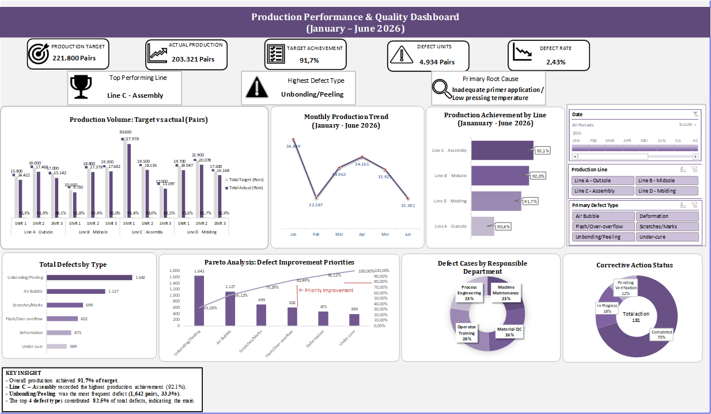

📊 Production & Quality Performance Dashboard

## Project Overview

I developed this interactive Excel dashboard using a simulated footwear manufacturing dataset to monitor production performance and product quality. The dashboard includes production KPIs, production trends, defect analysis, Pareto analysis, root cause identification, and corrective action monitoring through dynamic charts and slicers. This project demonstrates my ability to transform manufacturing data into interactive dashboards and actionable business insights using Microsoft Excel.

## Dashboard Preview

## Tools Used

- Microsoft Excel
- PivotTable & PivotChart
- Slicers
- XLOOKUP
- GETPIVOTDATA

## Dataset

This project uses a simulated dataset created for portfolio purposes only and does not contain any confidential company information.
